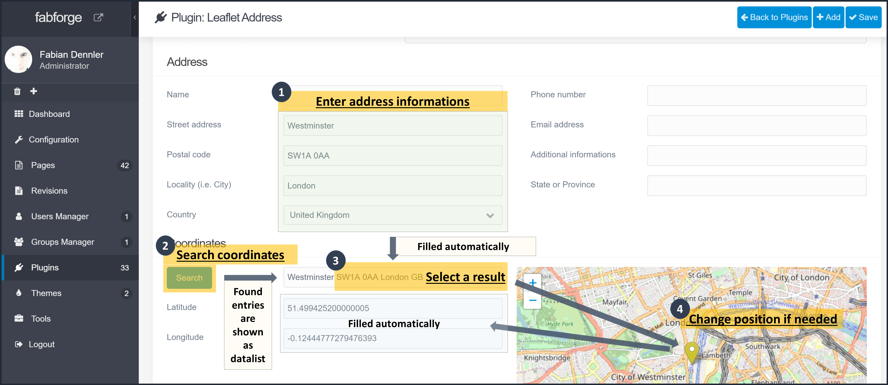

# Leaflet Address Plugin

**Leaflet Address** is a [Grav CMS](http://github.com/getgrav/grav) Plugin thats add the ability to easily embed a leaflet map to display an address with a marker.

## Installation

Installing the Leaflet Address plugin can be done in one of two ways. The GPM (Grav Package Manager) installation method enables you to quickly and easily install the plugin with a simple terminal command, while the manual method enables you to do so via a zip file.

### GPM Installation (Preferred)

The simplest way to install this plugin is via the [Grav Package Manager (GPM)](http://learn.getgrav.org/advanced/grav-gpm) through your system's Terminal (also called the command line).  From the root of your Grav install type:

    bin/gpm install leaflet-address

This will install the Leaflet Address plugin into your `/user/plugins` directory within Grav. Its files can be found under `/your/site/grav/user/plugins/leaflet-address`.

### Manual Installation

* Download the zip version of this repository from [GitHub](https://github.com/foxfabi/grav-plugin-leaflet-address).
* Unzip it under `/your/site/grav/user/plugins`.
* Rename the folder to `leaflet-address`.

You should now have all the plugin files under

    /your/site/grav/user/plugins/leaflet-address

> NOTE: This plugin is a modular component for Grav which requires [Grav CMS](http://github.com/getgrav/grav). If available the [Administration Panel](https://github.com/getgrav/grav-plugin-admin) with [Form](https://github.com/getgrav/grav-plugin-form) can be used for configuration.

## Configuration

Before configuring this plugin, you should copy the `user/plugins/leaflet-address/leaflet-address.yaml` to `user/config/plugins/leaflet-address.yaml` and only edit that copy.

Here is a sample configuration:

```yaml
enabled: true
address:
  country: IT
  name: name
  address: 'Street address'
  zip: 'Postal code'
  city: Locality
  phone: 'Phone number'
  email: email@address.local
  state: 'State or Province'
  subaddress: 'Additional Address'
leaflet:
  zoom: 13
  icon: Yellow
  coordinates: '41.0819847,14.252262'
cdn: true
provider: OpenStreetMap.Mapnik
```

Options are pretty self explanatory.

### Map tiles providers

At the moment the following map tiles are available:

* [OpenStreetMap](https://maps.openstreetmap.org/)
* [OpenTopoMap](https://opentopomap.org): a free, topographic map
* [Hydda](http://maps.openstreetmap.se): OpenStreetMap Sverige
* [Stamen Design](http://maps.stamen.com): maybe the best maps on the web
* [Esri](https://www.arcgis.com/home/webmap/viewer.html?useExisting=1): they build ArcGIS, the world’s most powerful mapping & spatial analytics software
* [MtbMap](http://maps.mtbmap.cz/): a free map for mountain biking (MTB) and hiking
* [CartoDB](https://maps.carto.com/): for your Location Intelligence use cases
* [HikeBike](https://hikebikemap.org/): another map for hiking and biking.
* [Wikimedia maps](https://maps.wikimedia.org/)

**Please note the general terms and conditions of the designated map tiles provider.**
OpenStreetMap data is free for everyone to use. The [tile servers are not](https://operations.osmfoundation.org/policies/tiles/).
Do you see something on the map that needs editing? Log into OpenStreetMap to [fix it](https://www.openstreetmap.org/fixthemap) and help make the map better for everyone! :)

### Using the Administration Panel plugin

If you use the admin plugin, a file named `leaflet-address.yaml` with your configuration will be saved in the `user/config/plugins/` folder once the configuration is saved.

When entering address, postcode, city and country, the coordinates search field will be completed accordingly. The search for coordinates uses the [photon.komoot.de](https://photon.komoot.de/) API and returns the first six matching entries. When selecting a result, the associated coordinates (longitude, latitude) are entered in the corresponding fields. You can also click on the map to change the marker position and get the `latitude,longitude` of the selected location.



## Usage

The plugin provides two Twig template that you can include in your theme or page where you want to add the leaflet map and address. Something like:
```


```

The plugin also provide a shortcode (**p**lugin **l**eaflet **a**ddress short**c**ode **e**mbed):

`[place]`

Options:

* `[place type="addr"]` - display leaflet address (Using `leaflet-address.html.twig`)
* `[place type="map"]` - display leaflet address map (Using `leaflet-address-map.html.twig`)

## Credits

* Thanks to [Tribly Media](https://trilby.media/) for creating and supporting [Grav CMS](https://getgrav.org/).
* The [Marker icons](https://github.com/pointhi/leaflet-color-markers) are provided by [Thomas Pointhuber](https://github.com/pointhi).
* Thanks to [Leaflet](https://leafletjs.com/) contributors, originally created by [Vladimir Agafonkin](https://agafonkin.com/).
* Thanks to [Leaflet-providers](https://github.com/leaflet-extras/leaflet-providers) maintainers, originally created by Stefan Seelmann.
* Open Data by [OpenStreetMap](https://www.openstreetmap.org) contributors
* Thanks to the tile servers based on OSM data: [OpenStreetMap](https://maps.openstreetmap.org/), [OpenTopoMap](https://opentopomap.org),[Hydda](http://maps.openstreetmap.se), [Stamen Design](http://maps.stamen.com), [Esri](https://www.arcgis.com/home/webmap/viewer.html?useExisting=1), [MtbMap](http://maps.mtbmap.cz/), [CartoDB](https://maps.carto.com/), [HikeBike](https://hikebikemap.org/), [Wikimedia maps](https://maps.wikimedia.org/)

## To Do

[] Check if zoom does not exceed maxZoom of map provider
[] [x] Translations (EN, DE)
